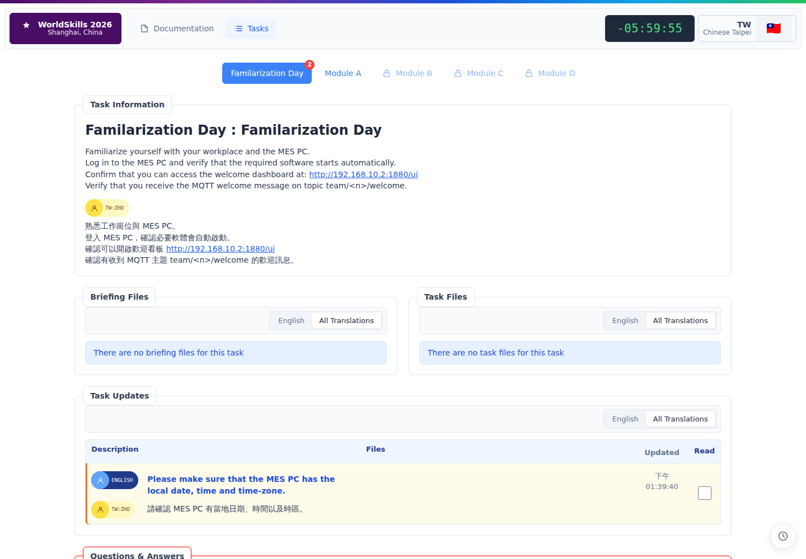
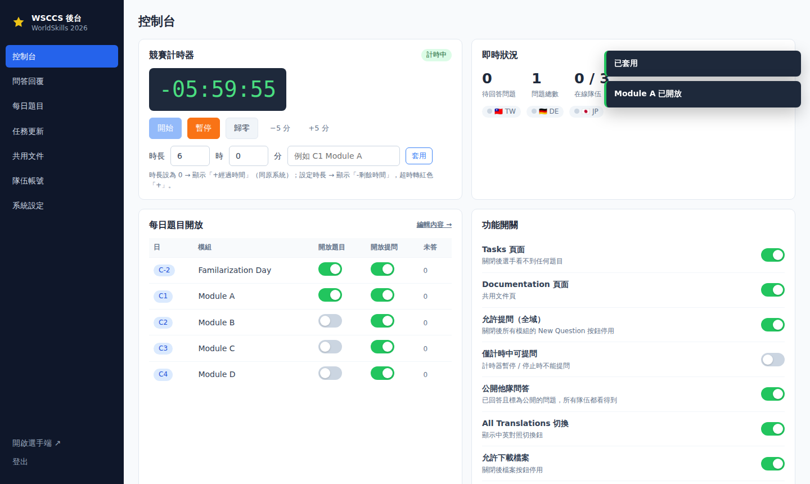

# WSCCS Trainer — WSC 4 天競賽控制系統（選手端 + 裁判後台）

仿 WorldSkills 2026 Shanghai 競賽現場使用的 **WSCCS（Competition Control System）** 版面與流程，
給 Skill 48 Industry 4.0 國手做 **4 天模擬賽**（C-2 熟悉日 + C1–C4 Module A–D）。

- **選手端**（`/`）：Documentation、Tasks、競賽計時器、Task Information、Briefing / Task Files、
  Task Updates、Questions & Answers、English / All Translations 切換、Read 勾選、即時通知＋提示音、通知紀錄。
- **裁判後台**（`/admin`）：回答問題（含常用標準回覆）、逐日開放 / 關閉題目、開關各項功能、
  發佈任務更新（含附件）、上傳題本與提供檔案、隊伍帳號、計時器、廣播訊息、備份還原。

| 選手端 | 裁判後台 |
|---|---|
|  |  |

> 這是訓練用的非官方複製版，與 WorldSkills International 無關。儲存庫只放程式碼與示範資料；
> 實際題本（PDF）、大會問答等內容請用下方匯入工具在自己的電腦匯入，不要推到公開儲存庫。

---

## 快速開始

需要 Node.js 18 以上。

```bash
git clone https://github.com/optyne/wsccs-trainer.git
cd wsccs-trainer
npm install
npm run seed        # 建立示範資料（隊伍 TW / DE / JP，密碼 demo1234）
npm start           # http://localhost:8080  後台 http://localhost:8080/admin（預設密碼 admin）
```

同網段的選手電腦 / 平板用 `http://<主機 IP>:8080/` 連線即可。

### Docker

```bash
docker compose up -d --build     # 預設對外 80 埠，後台密碼在 docker-compose.yml 的 ADMIN_PASSWORD
```

資料存在 `./data/db.json`，上傳的檔案在 `./uploads/`。

---

## 4 天賽程怎麼跑

| 競賽日 | 模組 | 後台操作 |
|---|---|---|
| C-2 | Familarization Day | 開放 → 選手確認 MES PC、網路、MQTT |
| C1 | Module A | 早上開放 Module A、計時器設 6 小時按「開始」 |
| C2 | Module B | 開放 Module B；前一天的模組可保持開放供查閱 |
| C3 | Module C | 同上 |
| C4 | Module D | 同上；中途用「任務更新」追加檔案（例如 Wireshark 紀錄、ARP 表） |

模組、競賽日標籤、按鈕名稱都可在後台「每日題目」修改或新增。

### 後台功能對照

| 功能 | 位置 | 說明 |
|---|---|---|
| 回答問題 | 問答回覆 | 待回答問題排最前、側欄顯示數量、新問題會響鈴。可填英文＋中文回覆、問題翻譯、選擇是否公開給所有隊伍、移到其他模組。一鍵帶入大會常用回覆（"It is not specified in the task." 等）。 |
| 開放每天的題目 | 控制台 / 每日題目 | 「開放題目」開關；開放時選手端立即出現並跳通知。未開放的模組以鎖頭顯示、API 也拒絕存取。 |
| 開啟 / 關閉功能 | 控制台 → 功能開關 | Tasks 頁、Documentation 頁、允許提問（全域 / 各模組）、僅計時中可提問、公開他隊問答、翻譯切換、下載、Read 欄、提示音。 |
| 題本與提供檔案 | 每日題目 | 拖曳上傳；`zh_hant_` 開頭自動標為繁中、`zh_` 開頭標為簡中。English 模式只顯示英文檔。 |
| 任務更新 | 任務更新 | 英文＋中文內容、附件；可先存草稿再發佈，發佈時選手端通知＋響鈴。 |
| 計時器 | 控制台 | 開始 / 暫停 / 歸零 / ±5 分。時長 0 顯示「+經過時間」（同原系統）；設定時長顯示倒數，超時變紅。 |
| 廣播 | 控制台 | 對全部或單一隊伍送出訊息。 |
| 隊伍 | 隊伍帳號 | 代碼、名稱、emoji 旗幟、密碼；在線狀態、已讀數。 |
| 備份 / 重設 | 系統設定 | 下載 / 還原 JSON；「重設競賽」清空問答與已讀、模組回到未開放，保留題目檔案，方便重跑模擬。 |

---

## 匯入大會 CCS 頁面（另存的 WS CCS*.html）

如果你有從實際 CCS「另存新檔」的頁面（每個模組一頁，例如 Google Drive 上的 `Day A/WS CCS2.html`），
可以把題目說明、檔案、Task Updates、Q&A 一次匯進來：

```bash
# 1. 把整個資料夾下載到本機，例如 ~/Downloads/worldskills（含 Day A、Day B…、given_data 等子資料夾）
# 2. 匯入（伺服器先停止，或匯入後重新啟動）
node scripts/import-ccs.js ~/Downloads/worldskills --date 2026-09-22
#   --release   匯入後全部開放（預設全部未開放，由後台逐日開放）
#   --no-qa     不匯入問答（想讓選手從零開始提問時）
#   --dry-run   只顯示會匯入什麼
```

- 自動忽略 Google Drive 下載時加上的 `_xxxxxxxxxx` 亂碼尾碼來比對檔名。
- 同資料夾中的 `zh_hant_…pdf`、`zh_…pdf` 會自動加為翻譯版題本。
- 頁面列出但資料夾中找不到的檔案會列在最後，可到後台手動上傳。
- 自己隊伍（頁面右上角那隊）的問答會對應到同代碼的隊伍帳號；其他隊伍顯示為「—」。

---

## eInk API 模擬器（E-Label 寫入，Module C / D）

賽場的 E-Label 是透過中央工廠 `192.168.10.2:3001` 的 eInk API 寫入；離開賽場（研討會、平時訓練）就沒有這台伺服器。
`eink-sim/` 用**同一組端點**模擬它，並把標籤畫在網頁上，選手原本的 Node-RED flow 只要改 host 就能跑。

```bash
npm run eink-sim                    # http://localhost:3001/  虛擬標籤看板；API 在 /api/ws26/
EINK_TEAMS="team_25:密碼" EINK_LABELS="8173E4476" EINK_REFRESH_MS=4000 npm run eink-sim
```

| 端點 | 行為 |
|---|---|
| `POST /api/ws26/login` | `{teamId, password}` → `{token}`（未設 `EINK_TEAMS` 時任意帳密皆可） |
| `PUT /api/ws26/labels/{barcode}` | title / subtitle / message / messageTextColor / messageBackgroundColor / nfcUrl / qrCode / imageDataUrl；回 `{"success":true,"message":"Data successfully sent to the API"}`，畫面延遲 `EINK_REFRESH_MS` 後才更新 |
| `POST /api/ws26/labels/{barcode}/overlay` | 遮罩圖（Module D 模擬顯示故障）；與實機相同，須先成功寫入過一次 |
| `DELETE /api/ws26/labels/{barcode}/overlay` | 移除遮罩 |

- 看板 `/`：所有標籤即時顯示、API 呼叫紀錄、每張標籤可注入故障（回 500 / 不回應 / 不刷新）訓練錯誤處理。
- `/label/{barcode}`：單一標籤全螢幕，放在手機或平板上擺在托盤右端，ML 相機可拍到 **Code 128 ID 條碼與 QR code**（已用 ZXing 驗證可解碼）。
- 預設 PUT 為**整筆取代**（沒傳的欄位清空）；實機若為合併行為，設 `EINK_MERGE=1`。
- 若研討會要把 Node-RED 完全不改，可把模擬器主機設成 `192.168.10.2`、埠 3001。

---

## 專案結構

```
server.js              Express API + SSE 即時推播
lib/store.js           JSON 檔資料庫（data/db.json）
public/index.html      選手端（純 JS，無需 CDN，可離線在賽場內網使用）
public/admin.html      裁判後台
scripts/seed-demo.js   示範資料
scripts/import-ccs.js  匯入另存的 WS CCS 頁面
eink-sim/              eInk API 模擬器 + 虛擬 E-Label
tests/                 API 流程測試（npm test）
```

環境變數：`PORT`（預設 8080）、`ADMIN_PASSWORD`（預設 admin，後台可改）、`DATA_DIR`、`UPLOAD_DIR`。

## 授權

MIT
